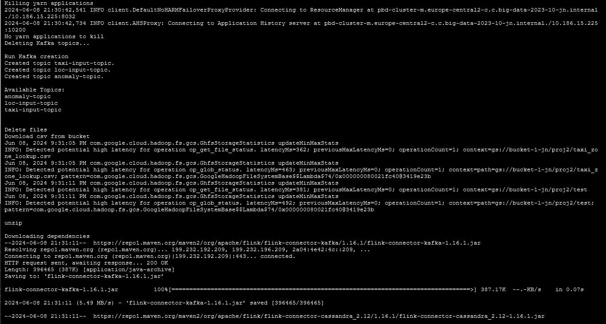
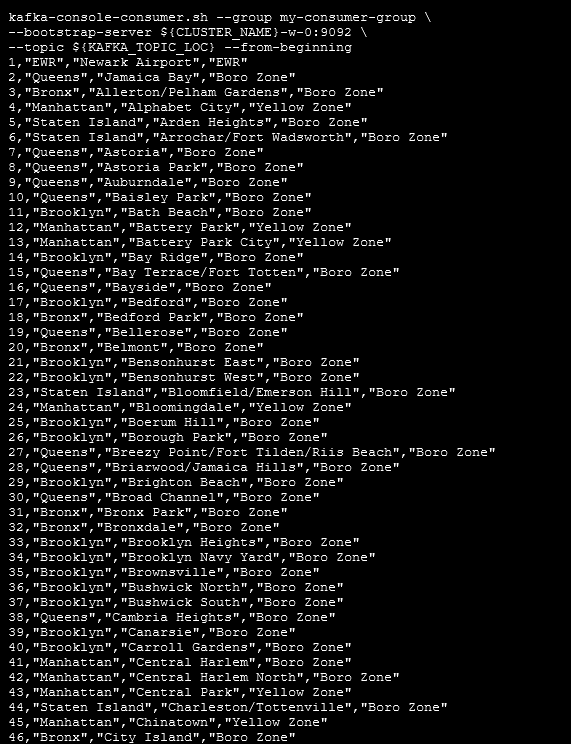
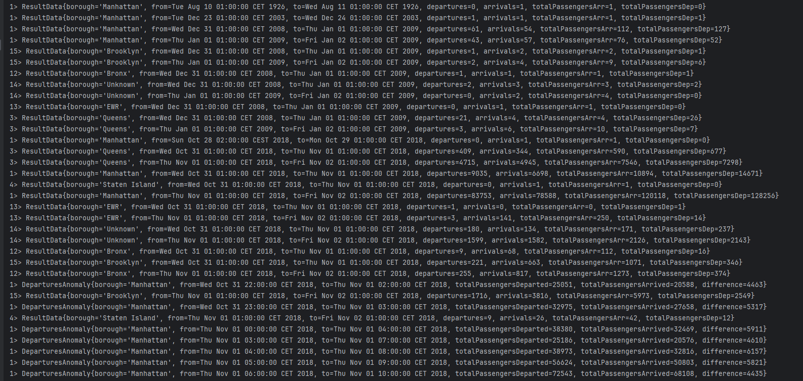
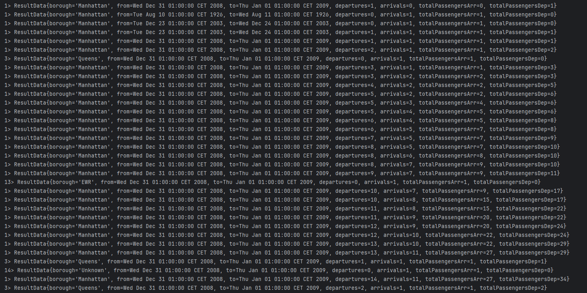
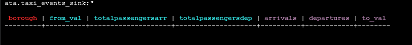

# Sprawozdanie - Apache Flink - NYC Yellow Taxi 

## Prepare the environment (Producent; skrypty inicjujące i zasilający)
```
gcloud dataproc clusters create ${CLUSTER_NAME} \
--enable-component-gateway --region ${REGION} --subnet default \
--master-machine-type n1-standard-4 --master-boot-disk-size 50 \
--num-workers 2 --worker-machine-type n1-standard-2 --worker-boot-disk-size 50 \
--image-version 2.1-debian11 --optional-components ZOOKEEPER,DOCKER,FLINK \
--project ${PROJECT_ID} --max-age=3h \
--metadata "run-on-master=true" \
--initialization-actions gs://goog-dataproc-initialization-actions-${REGION}/kafka/kafka.sh
```

1. Download package from [https://github.com/JNeubau/BD-Flink-NYC-yellow-taxi.git]().
Unpack the files.
2. Make sure that source data is in your bucket in with the original name.
3. Execute``` chmod +x *.sh ```
4. Change vaiables in `environ.sh` file to match your data
- `INPUT_DATA_LOCATION` - your bucket
- `INPUT_DATA_LOC_FILE` - static input data
- `INPUT_DATA_DIR_TAXI` - folder with events

```
git clone https://github.com/JNeubau/BD-Flink-NYC-yellow-taxi.git
cd BD-Flink-NYC-yellow-taxi/
mv * ../
chmod +x *.sh
```
5. Run the  `setup.sh` script to prepare environment
6. Using `vim flink.properties` create a file and pase the following data, changing `CASSANDRA_HOST`, `BOOTSTRAP_SERVERS`, `taxiData.directoryPath`, `zoneFile.path` according to your data. CASSANDRA_HOST is value of cluster name with '-m' (ex: `pdb-cluster-m`) and BOOTSTRAP_SERVERS is value of cluster name with '-w-0:9092' (ex: `pdb-cluster-w-0:9092`)
```
taxiData.directoryPath = test/
zoneFile.path = taxi_zone_lookup.csv

taxiEvents.maxElements = 10000
taxiEvents.elementDelayMillis = 100

FLINK_ANOMALY_TIME = 4
FLINK_ANOMALY_PEOPLE = 1000
DELAY_VERSION = C

BOOTSTRAP_SERVERS = pdb-cluster-w-0:9092
TAXI_INPUT_TOPIC = taxi-input-topic
LOC_INPUT_TOPIC = loc-input-topic
ANOMALY_OUTPUT_TOPIC = anomaly-topic
KAFKA_GROUP_ID = kafka-group-id
#FLINK_DELAY = flink-delay
#FLINK_CHECKPOINT_DIR = flink-checkpoint-dir

CASSANDRA_HOST = pdb-cluster-m
CASSANDRA_PORT = 9042
```
7. Execute these commands:
```
mkdir -p src/main/resources/
mv flink.properties src/main/resources/
```
8. Upload the jar file `TaxiEventsAnalysis.jar` and move it to to your working directory. 
```
mv ~/TaxiEventsAnalysis.jar ./
```

9. In one of the terminals run the `sender-kafka_taxi.sh` script to start sending data via kafka producer.

- setup.sh

- reciver-kafka.sh

10. At this time, it should be possible to run the script using `./run.sh` unfortunately te JAR file does not work correctly and cannot be run on gcloud.

11. To check if sources work these commands can be used:
- for event data
```
source ./environ.sh (after running `sender-kafka_taxi.sh`)
kafka-console-consumer.sh --group my-consumer-group \
--bootstrap-server ${CLUSTER_NAME}-w-0:9092 \
--topic ${KAFKA_TOPIC_TAXI} --from-beginning
```

- for static data (after running `setup.sh`)
```
source ./environ.sh
kafka-console-consumer.sh --group my-consumer-group \
--bootstrap-server ${CLUSTER_NAME}-w-0:9092 \
--topic ${KAFKA_TOPIC_LOC} --from-beginning
```

- example (static):


12. If the project worked, the output could be checked:
- for anomalies `./reciver-anomaly.sh` to read anomalies from kafka topic
- for normal output via `./show_output.sh` to view table with results. Without the working JAR, it will be empty. [section-Read (Konsument: skrypt odczytujący wyniki przetwarzania)](#read-konsument-skrypt-odczytujący-wyniki-przetwarzania)

## Transformations (Utrzymanie obrazu czasu rzeczywistego – transformacje)
#### For current version, I could not verify the part reading from Kafka source and saving data in database and kafka. Those parts are placed in `connectors` package (without TaxiEventSource file). The classes below will explain it's functions being based on reading local file and printing data in the InteliJ console. Sources code and explenation can be found [at the bottom: Kafka sources](#kafka-sources)

1. `Connectors.TaxiEventSource` is a file used for reading events data from localy placed file.
`tools.EnrichWithLocData` is a file used to read the contents of the static file. It returns taxi data with added pieces of relevant information from static data file.

2. In the main file `TaxiEventsAnalysis` the flow is as follows:
```
/* Join two types of data */
DataStream<TaxiLocEvent> taxiLocEventsDS = taxiEventsDS
    .map(new EnrichWithLocData(properties.getRequired("zoneFile.path")))
    .assignTimestampsAndWatermarks(
            WatermarkStrategy.<TaxiLocEvent>forBoundedOutOfOrderness(Duration.ofDays(1))
                    .withTimestampAssigner(((taxiLocEvent, l) -> taxiLocEvent.getTimestamp().toInstant().
                            getEpochSecond() * 1000))
    );
```
The ```assignTimestampsAndWatermarks(
            WatermarkStrategy.<TaxiLocEvent>forBoundedOutOfOrderness(Duration.ofDays(1))...)``` shows that data late for one day will be still considered in the given windows.

2. 
```
/* Dokonywanie obliczeń dla
        - każdej dzielnicy
        - każdego kolejnego dnia
    Dla zmiennych:
        - ile było wyjazdów (startStop = 0),
        - ile było przyjazdów (startStop = 1)
        - liczba pasażerów obsłużona dla przyjazdów
        - liczba pasażerów obsłużona dla wyjazdów
*/
String delay = properties.getRequired("DELAY_VERSION");

DataStream<ResultData> taxiLocStatsDS = taxiLocEventsDS
    .keyBy(TaxiLocEvent::getBorough)
    .window(TumblingEventTimeWindows.of(Time.days(1)))
    .trigger((Objects.equals(delay, "A")) ? EveryEventTimeTrigger.create() : EventTimeTrigger.create())
    .aggregate(new TaxiLocAggregator(), new GetFinalResultWindowFunction());
```
The ```window(TumblingEventTimeWindows.of(Time.days(1)))``` creates windows that last for one day and ensures there is max 1 window at given time. ResultData is the final form of data in the output.

Data is grouped by the *borough* variable. Windows are created aggregating data by one day. Trigger is chosen based on the delay option (*A* or *C*) with default value being *C* (completness). Tan data is aggregated using below AggregateFunction class and ProcessWindowFunction class.

```
public class TaxiLocAggregator implements AggregateFunction<TaxiLocEvent, TaxiLocAccumulator, TaxiLocStats> {
    ...
    @Override
    public TaxiLocAccumulator add(TaxiLocEvent value, TaxiLocAccumulator accumulator) {
        if (value.getStartStop() == 0) {
            accumulator.addDeparture(value.getPassengerCount());
        } else if (value.getStartStop() == 1) {
            accumulator.addArrival(value.getPassengerCount());
        }
        return accumulator;
    }
    ...
}
```
`GetFinalResultWindowFunction` is a function for processing the final ResultData and is ussed with aggregation function `TaxiLocAggregator`
```
public class GetFinalResultWindowFunction extends ProcessWindowFunction<TaxiLocStats, ResultData, String, TimeWindow> {
    @Override
    public void process(String key, Context context, Iterable<TaxiLocStats> input, Collector<ResultData> out) {
        int departures = 0;
        int arrivals = 0;
        int totalPassengersArr = 0;
        int totalPassengersDep = 0;

        for (TaxiLocStats stats : input) {
            departures += stats.getDepartures();
            arrivals += stats.getArrivals();
            totalPassengersArr += stats.getTotalPassengersArr();
            totalPassengersDep += stats.getTotalPassengersDep();
        }

        Instant windowStart = Instant.ofEpochMilli(context.window().getStart());
        Instant windowEnd = Instant.ofEpochMilli(context.window().getEnd());

        ResultData resultData = new ResultData(
                key,
                Date.from(windowStart),
                Date.from(windowEnd),
                departures,
                arrivals,
                totalPassengersArr,
                totalPassengersDep);

        out.collect(resultData);
    }
}
```

3. Anomalies are considered and filtered [see in Anomalies (Wykrywanie anomalii) section](#anomalies-wykrywanie-anomalii)

## A delay (Utrzymanie obrazu czasu rzeczywistego – obsługa trybu A)
`EveryEventTimeTrigger` is an overwriten class of Trigger that enables the smallest possible delay. [Use examples](#examples)
```
public class EveryEventTimeTrigger extends Trigger<Object, TimeWindow> {
    ...
    @Override
    public TriggerResult onElement(
            Object element, long timestamp, TimeWindow window, TriggerContext ctx) {
        return TriggerResult.FIRE;
    }

    @Override
    public TriggerResult onEventTime(long time, TimeWindow window, TriggerContext ctx) {
        return TriggerResult.CONTINUE;
    }

    @Override
    public TriggerResult onProcessingTime(long time, TimeWindow window, TriggerContext ctx) {
        return TriggerResult.CONTINUE;
    }
    ...
}
```

## C delay (Utrzymanie obrazu czasu rzeczywistego – obsługa trybu C)
A standard `EventTimeTrigger` is used to achive completness trigger [Use examples](#examples)

## Anomalies (Wykrywanie anomalii)
- call of `TaxiLocAggregator` (the same which was used in normal processing) and `GetAnomalyWindowFunction` (slightly changed class printing the data with different data model) functions are used to aggregate data. `Filter` is used to choose data which are above chosen parameters.
```
DataStream<DeparturesAnomaly> anomalyOutput = taxiLocEventsDS
    .keyBy(TaxiLocEvent::getBorough)
    .window(SlidingEventTimeWindows.of(
        Time.hours(anomalyTime),
        Time.hours(1)))
    .aggregate(new TaxiLocAggregator(), new GetAnomalyWindowFunction())
    .filter(departuresAnomaly -> departuresAnomaly.getDifference() >= anomalyPeople);
```
- Class processing data:
```
public class GetAnomalyWindowFunction extends ProcessWindowFunction<TaxiLocStats, DeparturesAnomaly, String, TimeWindow> {
    @Override
    public void process(String key, Context context, Iterable<TaxiLocStats> input, Collector<DeparturesAnomaly> out) {
        int departures = 0;
        int arrivals = 0;
        int totalPassengersArr = 0;
        int totalPassengersDep = 0;

        for (TaxiLocStats stats : input) {
            departures += stats.getDepartures();
            arrivals += stats.getArrivals();
            totalPassengersArr += stats.getTotalPassengersArr();
            totalPassengersDep += stats.getTotalPassengersDep();
        }

        Instant windowStart = Instant.ofEpochMilli(context.window().getStart());
        Instant windowEnd = Instant.ofEpochMilli(context.window().getEnd());

        DeparturesAnomaly departuresAnomaly = new DeparturesAnomaly(
                key,
                Date.from(windowStart),
                Date.from(windowEnd),
                totalPassengersArr,
                totalPassengersDep,
                totalPassengersDep - totalPassengersArr);

        out.collect(departuresAnomaly);
    }
}
```

## Examples

The above piece of output is generated for ***C type*** and ***Anomalie***, both printed to console output (in InteliJ) for ***200 000*** elements in the input data. A ***4-hour*** time window during which the difference between people, who departed the borough and people who arravied to it, is over ***4000*** people is considered an anomaly


The above piece is the output generated for ***A type***, printed to the console (in InteliJ). 

The diffference between the two outputs can be seen easily.

## Run the script (Program przetwarzający strumienie danych; skrypt uruchamiający)
`./run.sh` 

## Output

### Create (Miejsce utrzymywania obrazów czasu rzeczywistego – skrypt tworzący)
Last part of initialization script takes care of setting up the Cassandra database. It is achived by utilizing the `Docker Compose` mechanism.

```
# docker-compose.yml
services:
  cassandra:
    image: cassandra:latest
    container_name: cassandra
    ports:
      - "9042:9042"
    environment:
      - CASSANDRA_USER=admin
      - CASSANDRA_PASSWORD=admin
    healthcheck:
      test: [ "CMD", "cqlsh", "-u cassandra", "-p cassandra" ,"-e describe keyspaces" ]
      interval: 15s
      timeout: 10s
      retries: 10
```

```
# a part of setup.sh
docker exec -it cassandra cqlsh -e "CREATE KEYSPACE IF NOT EXISTS taxi_data WITH replication = {'class': 'SimpleStrategy', 'replication_factor' : 1};
    USE taxi_data;
    CREATE TABLE IF NOT EXISTS taxi_events_sink
    (
        borough                TEXT,
        from_val               TEXT,
        to_val                 TEXT,
        departures             BIGINT,
        arrivals               BIGINT,
        totalPassengersArr     BIGINT,
        totalPassengersDep     BIGINT,
        PRIMARY KEY ((borough), from_val, totalPassengersArr, totalPassengersDep)
    );
    TRUNCATE taxi_data.taxi_events_sink;"
```

### Characteristics (Miejsce utrzymywania obrazów czasu rzeczywistego – cechy)
Why Cassandra?
- available conncetor for Flink, making transfering of data simple
- scalability - NoSQL database, that can be easily expanded to match app requirements
- efficiency with writing data - perfect for processing data in real time and frequest data changes

### Read (Konsument: skrypt odczytujący wyniki przetwarzania)
`show_output.sh` file contains command to show contents of Cassandra database as shown below:

Before running the Flink JAR file, the database contents should be empty as shown abouve.

## Kafka sources

Kafka Sources are available with `getCassandraAggSink` in the `connectors.Connectors` file.
```
public static KafkaSource<TaxiEvent> getTaxiSource(ParameterTool properties) {
        return KafkaSource.<TaxiEvent>builder()
                .setBootstrapServers(properties.getRequired("BOOTSTRAP_SERVERS"))
                .setTopics(properties.getRequired("TAXI_INPUT_TOPIC"))
                .setGroupId(properties.getRequired("KAFKA_GROUP_ID"))
                .setStartingOffsets(OffsetsInitializer.committedOffsets(OffsetResetStrategy.EARLIEST))
                .setDeserializer(new TaxiDeserializator())
                .build();
    }
```

TaxiDeserializarot class needed for Kafka input source to deserialize obtained data and convert it into `TaxiEvents` class considered in next steps of processing.
```
public class TaxiDeserializator implements KafkaRecordDeserializationSchema<TaxiEvent> {

    @Override
    public void deserialize(ConsumerRecord<byte[], byte[]> consumerRecord, Collector<TaxiEvent> collector) throws IOException {
        try {
            TaxiEvent taxiEvent = TaxiEvent.fromString( new String(consumerRecord.value()));
            collector.collect(taxiEvent);
        } catch (ParseException e) {
            // Print malformed line to stderr
            System.err.println("Malformed line: " + Arrays.toString(consumerRecord.value()));
        }
    }

    @Override
    public TypeInformation<TaxiEvent> getProducedType() {
        return TypeInformation.of(TaxiEvent.class);
    }
}
```

Kafka Output source for anomalies data.

```
public static KafkaSink<String> getAnomalySink(ParameterTool properties) {
        return KafkaSink.<String>builder()
                .setBootstrapServers(properties.getRequired("BOOTSTRAP_SERVERS"))
                .setRecordSerializer(KafkaRecordSerializationSchema.builder()
                        .setTopic(properties.get("ANOMALY_OUTPUT_TOPIC"))
                        .setValueSerializationSchema(new SimpleStringSchema())
                        .build()
                )
                .setDeliverGuarantee(DeliveryGuarantee.AT_LEAST_ONCE)
                .build();
    }
```

